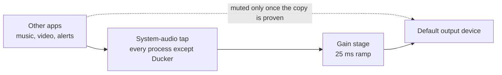

# Ducker

*Turns your music down while your microphone is live, and back up when it stops.*

Ducker is a macOS menu-bar utility that lowers other audio while the default
microphone is in use. It exists for voice dictation and voice agents, which flip
the microphone on and off all day — for a call you'd pause the music, but not
line by line. Any microphone near speakers picks the music up, and it's
distracting to talk over. macOS ducks for phone calls and Siri, and for nothing
else.

It ducks through a private Core Audio process tap rather than the volume control,
so it works on outputs with no volume to change — HDMI and DisplayPort monitors,
most audio interfaces — with no virtual audio driver and no kernel extension.
Your saved volume level is never touched.

The whole thing is nine source files, two thousand lines, system frameworks only;
installed, it's one menu-bar process and one launch agent. If you decide against
it, `./scripts/uninstall.sh` moves everything it installed to the Trash.

## Install

```sh
./scripts/install.sh
```

The script builds an ad-hoc-signed app for this Mac, installs it to
`~/Applications`, and registers a launch agent so it starts at login. It needs
macOS 14.2 or newer and the Xcode command-line tools.

On first launch Ducker introduces itself and offers **Enable & Test**. Choosing it
runs a three-second test, which is what triggers the macOS prompt for **System
Audio Recording** permission — see
[Permissions and privacy](#permissions-and-privacy) for why that's required, and
what Ducker does with it. Until you grant it, playback is left exactly as it is.
You can run the same test from the menu at any time.

## Using Ducker

Everything lives in the menu-bar icon.

| Menu item | What it does |
| --- | --- |
| **Enabled** | Turns ducking on and off. Off means Ducker touches nothing. |
| **Duck other audio to** | 10%, 20%, 35% or 50%. Defaults to 20%. |
| **Preferred microphone** | Pins a microphone as the system default whenever it's plugged in. Defaults to **Follow macOS**. |
| **Run 3-second test** | Forces ducking for three seconds so you can hear the effect and trigger the permission prompt. |
| **Open Privacy & Security…** | Jumps straight to the permission pane. |

The first line of the menu is a status line. It's worth knowing what it says:

| Status | Meaning |
| --- | --- |
| `Ready — <device>` | Armed and idle. The tap isn't open; nothing is playing, or your mic isn't live. |
| `Listening safely — <device>` | Your mic is live and the tap is open, but your audio is still playing untouched while Ducker confirms the tap actually works. |
| `Ducking — <device>` | The attenuated audio is what you're hearing. |
| `Bypassed — <device> (reason)` | The output is headphones or a headset, so ducking would serve no purpose. Not an error. |
| `Needs attention — <message>` | Something failed. Your original audio was left alone. |

### Bypass

The main reason to duck is to keep the room's speakers out of the room's
microphone. On headphones that can't happen, so Ducker stays out of the way. It bypasses an
output when the device reports a headphone terminal, when it's a Bluetooth device
that also exposes a microphone, or when its name matches a known headset — AirPods
and Sony WH-1000XM/WF-1000XM models.

### Preferred microphone

By default Ducker leaves input selection entirely alone. If you pick a specific
microphone, it will restore that device as the system default whenever it's
available; if you unplug it, macOS falls back normally and Ducker reinstates your
choice when it returns. This only sets the *system* default — apps configured to
use a particular microphone directly keep using it.

## Permissions and privacy

Core Audio requires the **System Audio Recording** permission for process taps.
There is no narrower permission that grants the ability to attenuate audio without
also granting the ability to read it.

Ducker reads those samples in the realtime callback, multiplies them by a gain
value, and writes them straight back out. Nothing is buffered, written to disk, or
sent anywhere. The log at `~/Library/Logs/Ducker/Ducker.log` records device names
and state changes, never audio.

It also never writes your master volume, so nothing has to be restored if the app
crashes or you kill it mid-duck.

## How it works

The trigger is the default microphone's device-level running state, so it fires
no matter which app opened the microphone. To duck, Ducker builds a private
aggregate device that wraps your current default output
together with a system-audio tap. The tap is *exclusive* and lists Ducker's own
process, which means it captures every process except Ducker — otherwise the
attenuated copy it plays would be captured and attenuated again, recursively.



The gain stage ramps over 25 ms in both directions rather than stepping, which is
what keeps the transition from clicking.

### Failing open

Muting your real audio before knowing the replacement works would mean silence on
every failure. So Ducker inverts the order:

1. Your mic goes live. The tap opens with muting **off** — your audio is still
   playing the normal way, and Ducker is only listening. This is the
   `Listening safely` state.
2. Ducker polls the tap until it has seen nonzero samples arrive. That's proof the
   path carries real audio, not just that the API calls returned successfully.
3. Only then does it enable its attenuated copy and mute the original, in the same
   step.

If the tap never delivers samples — permission denied, an output that can't be
tapped, a routing change mid-flight — nothing is ever muted and you keep hearing
your audio at full volume. The same holds if ducking fails to engage at step 3:
the copy is dropped and the original is left playing.

Ducker also defers opening the tap until something is actually playing, since
opening it starts an audio device and holds the hardware awake. When the default
output device changes, it tears the private path down and rebuilds it against the
new device.

## Build and test

```sh
./scripts/test.sh
```

This compiles and runs the C unit tests for the realtime gain and ramp code,
builds and signs the app, then exercises the output/input policy decisions and the
private audio pipeline without starting playback. `./scripts/build.sh` builds
alone, leaving the app in `build/Ducker.app`.

## Uninstall

```sh
./scripts/uninstall.sh
```

Stops the launch agent and moves the app and its plist to the Trash, so it's
recoverable. macOS keeps the System Audio Recording entry; remove it yourself in
**Privacy & Security** if you want it gone.

## Requirements

- macOS 14.2 or newer, Apple silicon or Intel. Developed against macOS 27.
- Xcode command-line tools.

## License

[MIT](LICENSE).
